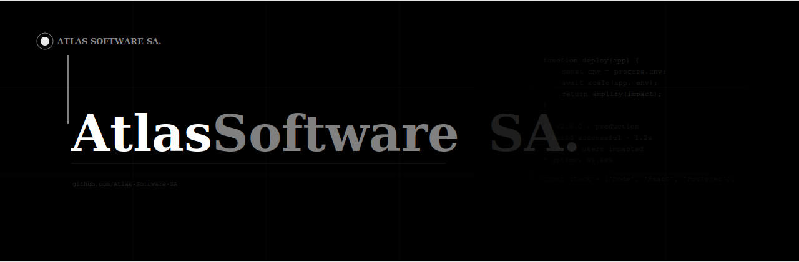

---

# Atlas Softhouse

Desenvolvimento de software sob medida para empresas — sistemas, APIs, automações e integrações.

## O que fazemos

- Sistemas desktop e web personalizados
- APIs REST e integração entre plataformas
- Automação de processos empresariais
- Consultoria técnica

## Stack

`Delphi` `Lazarus` `SQL` `REST APIs` `Web`

## Projetos

| Repositório | Descrição |
|---|---|
| [`atlas-api`](./atlas-api) | Backend e camada de serviços |
| [`atlas-web`](./atlas-web) | Base para aplicações web |
| [`atlas-core`](./atlas-core) | Bibliotecas internas compartilhadas |

## Contato

📧 contato@atlassofthouse.com
